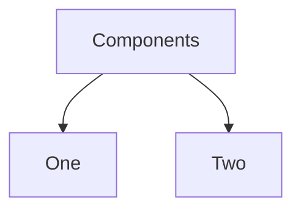

# Monorepo PoC 

A monorepo playground w/ two React apps (React) and shared components (without compilation).

<table>
<tr>
<td>

| ✨ | 🚥 |
| - | :-: |
| [Components](packages/components/) | |
| [One](packages/one/) |  |
| [Two](packages/two/) |  |

</td>
<td>

</td>
</tr>
</table>

## Links

- [Manage Monorepo with pnpm](https://egoist.dev/pnpm-monorepo)
- [Building the perfect GitHub CI workflow for your frontend team](https://blog.maximeheckel.com/posts/building-perfect-github-action-frontend-teams/)
- [Add Commitlint, Commitizen, Standard Version, and Husky to SvelteKit Project](https://davipon.hashnode.dev/add-commitlint-commitizen-standard-version-and-husky-to-sveltekit-project)
- [Ditching manual releases with Changesets](https://dnlytras.com/blog/using-changesets/)
- [Goodbye Dependabot, Hello Batch Dependency Updates](https://swyxkit.netlify.app/goodbye-dependabot-hello-batch-dependency-updates)
